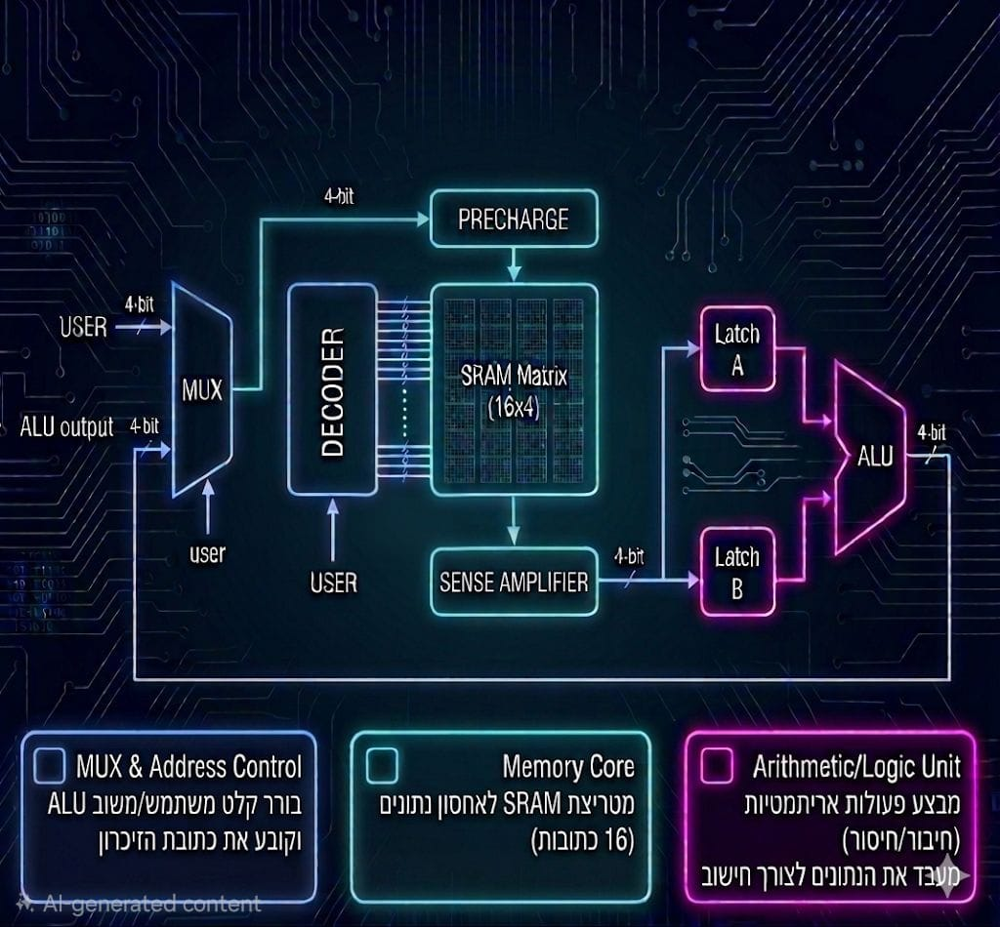
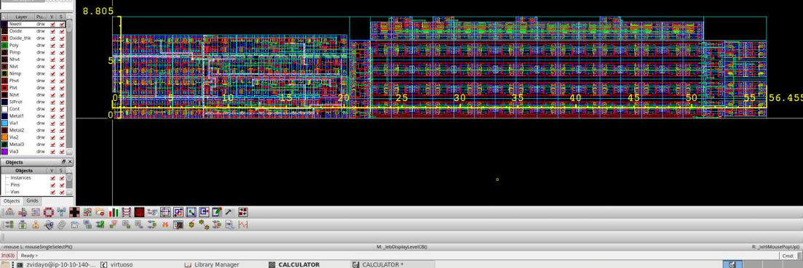
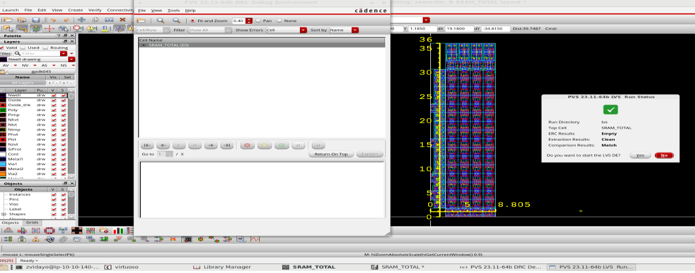
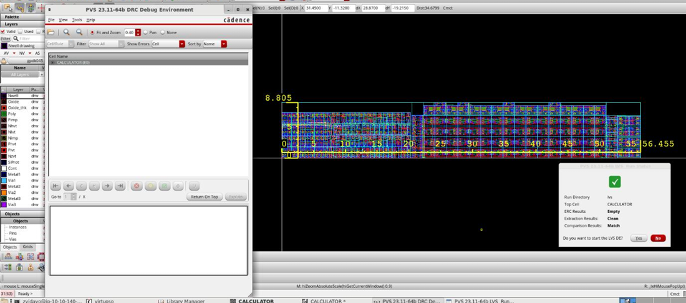

# SRAM-Integrated 4-bit ALU 
## Full-Custom CMOS Design | Cadence Virtuoso | 45nm Technology

### Project Overview
This project showcases the full-custom, transistor-level design of a synchronous computing block. It integrates a 4-bit Arithmetic Logic Unit (ALU) with a 64-bit SRAM matrix. The architecture focuses on the tight integration between memory storage and arithmetic operations, featuring a feedback loop for sequential data processing.

### System Architecture

*Figure 1: High-level architectural block diagram illustrating the data path from user input through the SRAM matrix to the ALU and the write-back feedback loop.*

### Technical Specifications
* **ALU:** 4-bit addition and subtraction using Sign and Magnitude representation.
* **Memory:** 64-bit SRAM Matrix (organized as 16 words x 4 bits).
* **Peripherals:**
    * **4x16 Decoder:** For precise row addressing and word-line activation.
    * **Precharge Circuitry:** To stabilize bitlines and ensure reliable read/write operations.
    * **Sense Amplifier:** Differential amplifier for high-speed data retrieval from the memory core.
* **Synchronization:** Dual-stage D-Latch buffers (Latch A & Latch B) for operand alignment and race-condition prevention.

### Physical Design Flow (Custom IC Flow)
1. **Schematic & Hierarchical Design:** Built from the ground up, starting from individual NMOS/PMOS transistors to logic gates, specialized macros (SRAM cells), and top-level integration.
2. **Floorplanning:** Managed a complex layout where memory cells, decoders, and logic units are strategically placed to minimize parasitic capacitance and optimize silicon area.
3. **Routing & Connectivity:** Executed manual routing across multiple metal layers to ensure 100% signal connectivity and robust power delivery.
4. **Physical Verification (Sign-off):**
    * **DRC (Design Rule Check):** Validated that the layout adheres to all **45nm** manufacturing constraints.
    * **LVS (Layout vs. Schematic):** Confirmed perfect structural matching between the physical layout and the electrical netlist.

### Key Engineering Challenges & Solutions
* **Timing & Synchronization:** Solved data arrival race conditions by implementing a dual-stage D-Latch synchronization scheme. This ensures that operands retrieved from memory are sampled simultaneously before entering the ALU.
* **Memory Density:** Optimized the SRAM matrix layout through tight cell-abutment and shared power-rail routing, significantly reducing the overall macro footprint.
* **Signal Integrity:** Managed the high fan-out of the 4x16 Decoder to ensure stable word-line activation across the entire matrix, preventing bit-errors during read cycles.
* **Data Flow Control:** Integrated 2-to-1 Multiplexers to manage the write-back path, allowing the system to toggle between external user inputs and internal ALU-computed results seamlessly.

### Results
* **Status:** DRC Clean & LVS Matched.
* **Functional Verification:** Successfully verified the complete system logic (ALU + Memory) through comprehensive Transient and Corner simulations in Cadence Virtuoso, ensuring data integrity across all operating conditions.

---

### Gallery

| Top-Level Layout | SRAM Matrix |
| :---: | :---: |
|  |  |

| DRC & LVS Verification |
| :---: |
|  |
